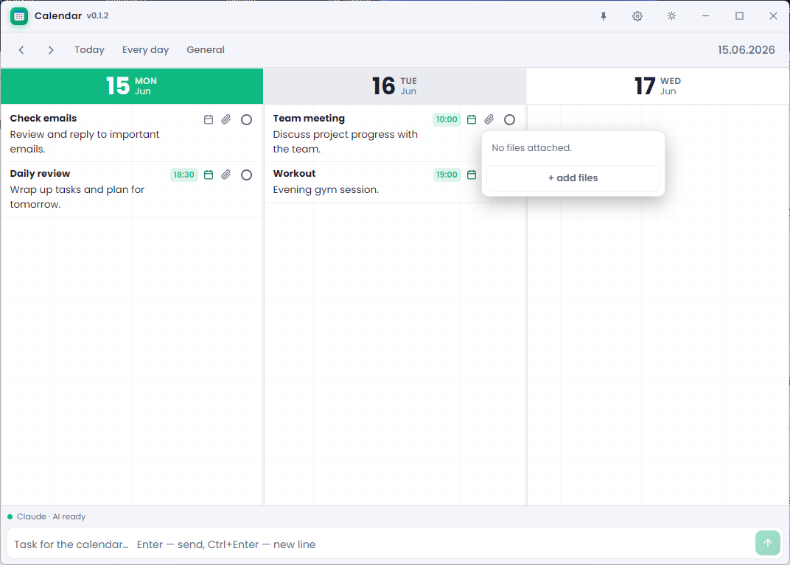
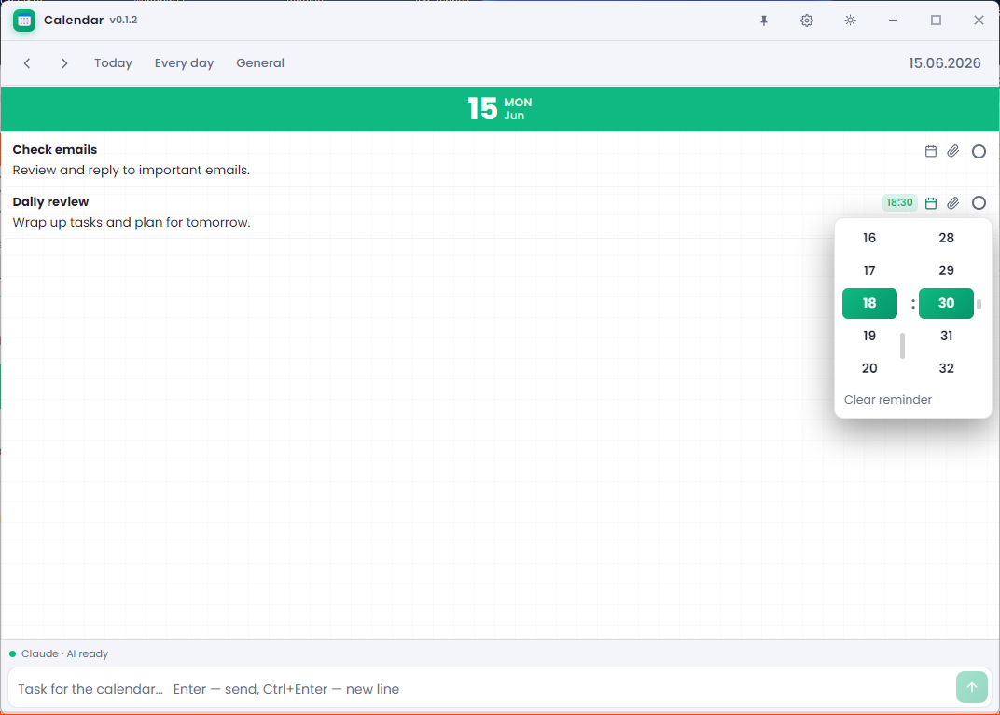
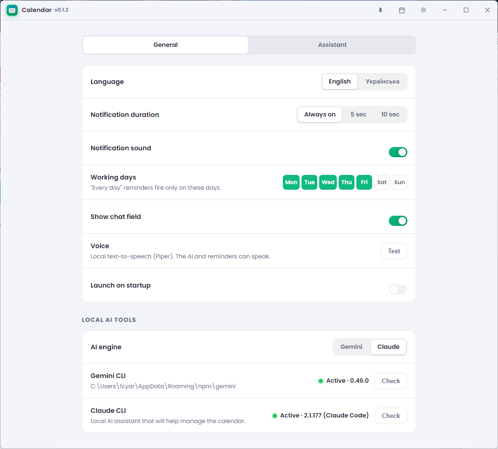
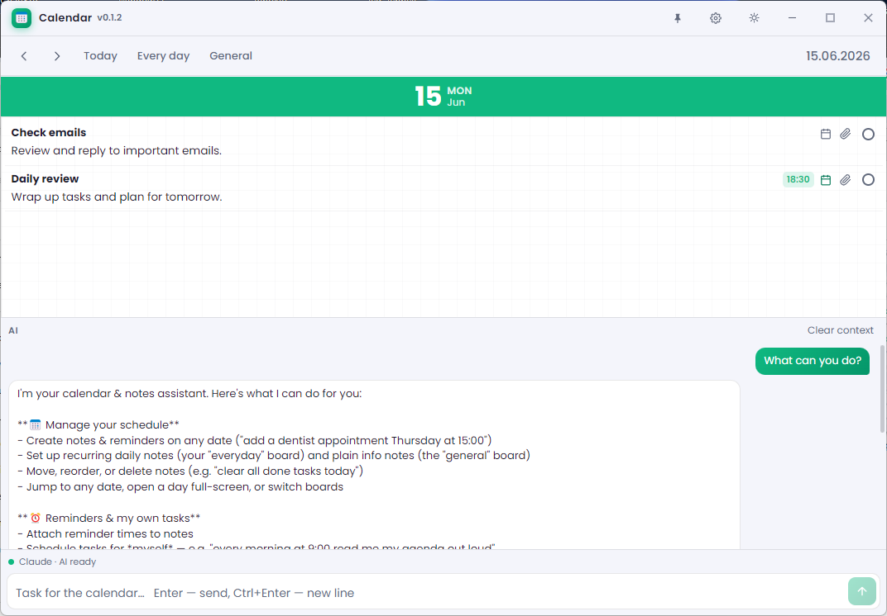

# 🗓️ Calendar — desktop calendar with notes and a voice AI assistant

A Windows desktop app built on Electron: an infinite calendar, notes with
reminders, and a built-in **local AI assistant** that drives the calendar,
answers questions about your notes, and **speaks out loud** — all running
locally, no cloud.

---

## 📸 Screenshots

| Calendar, notes & file attachments | Reminders with a custom time picker |
| --- | --- |
|  |  |

| Settings — working days, voice, local AI | Built-in AI assistant |
| --- | --- |
|  |  |

---

## ✨ Features

### Calendar & notes
- **Infinite day strip** — scroll left/right forever, smooth inertia and snap-to-day.
- **Per-day notes** — title, multi-line text, bold/italic, sizes, statuses (todo / in progress / done / cancelled).
- **Drag-and-drop** — reorder notes within a day (a placeholder shows where it'll land), drag a note to **another day**, or drop it onto the **Every day / General / Today** buttons to move it between boards.
- **"Every day" board** — recurring notes shown on every day.
- **"General" board** — plain notes (no reminder, no status) for storing info / scratch data.
- **File attachments** — attach multiple files to any note via the paperclip, or **drag-and-drop from the desktop**; click a file to open it in its default app (Word/Excel/PDF/…). Files are linked by path, so edits stay in the original.
- **Reminders** — set a time on a note; when it's due a toast pops up in a separate window (with sound), clicking it opens that day.
- **Working days** — choose which weekdays count as working; "every day" reminders fire only on those days.
- **Navigation** — arrow buttons or **Ctrl + ← / →** move the calendar day-by-day; **Ctrl + drag** pans freely; horizontal wheel scrolls.
- **Expand a day** — double-click a day's header to blow that day up to the full window width; double-click again to collapse back to the strip.
- **SQLite storage** — fast and reliable, only the requested day is read.
- **Dark/light theme**, UI in **🇺🇦 Ukrainian / 🇬🇧 English**, frameless window, minimize to tray.

### 🤖 AI assistant (local CLI)
Chat with a local AI (**Gemini CLI** or **Claude CLI**) — your data is not sent to a third-party cloud:
- **Keeps conversation context** (Gemini via a persistent ACP session for fast replies).
- **Controls the UI:** "go to this date", "open the every-day board", "expand fullscreen".
- **Creates notes & reminders by voice/text:** "meeting the day after tomorrow at 9am".
- **Searches across all notes:** "what meetings do I have this week?".
- **Sorts and deletes** notes by criteria.
- **Works with files:** attach a file to a note, or open an attached file on request ("open the file from my report note").
- **Knows the current date/time** and a 2-week date table — resolves "in a minute", "next Friday" correctly.

### 🔊 Voice (TTS) — built-in, offline
- **Piper** engine bundled into the app (no Python), voices for **🇺🇦 / 🇷🇺 / 🇬🇧**.
- The assistant **decides when to speak** (only when you ask) and in which language.
- **Playback queue** — phrases don't interrupt each other.
- **Audio server** on `127.0.0.1:51273` — any local process/agent can send text to be spoken:
  ```bash
  curl -X POST http://127.0.0.1:51273/speak \
    -H "Content-Type: application/json" \
    -d "{\"text\":\"Hello!\",\"lang\":\"en\"}"
  ```

### 🧠 Assistant memory & tasks
- **Memory** — the assistant remembers preferences ("create tasks in Ukrainian, speak to me in Russian"). Viewable and editable in Settings.
- **Scheduled assistant tasks** — it (or you) schedules a task for a time; when it's due the assistant "wakes up" and acts (e.g. reads the morning agenda aloud). All visible in Settings (the "Assistant" tab).

---

## 🧩 Stack

| Layer | Tech |
|-------|------|
| Shell | Electron 33 + electron-vite 5 + Vite 7 |
| UI | React 19 (plain JavaScript, **no TypeScript**) |
| Storage | better-sqlite3 |
| AI | local Gemini CLI (ACP) / Claude CLI |
| Voice | Piper (standalone, bundled in `resources/tts`) |
| Packaging | electron-builder (Windows NSIS) |

The codebase is decomposed into small modules — separate components, hooks,
icons and co-located CSS.

---

## 🚀 Getting started

```bash
npm install          # dependencies (native better-sqlite3 is rebuilt for Electron)
npm run dev          # development with hot reload
npm run build        # build without packaging
npm run dist         # build the .exe installer (Windows, into release/)
```

### Requirements for the AI chat
The chat works if one of these CLIs is installed and logged in:
- **Gemini CLI** — `npm i -g @google/gemini-cli`, then sign in with Google (`gemini`).
- **Claude CLI** — install and log in.

If no CLI is found / signed in, the calendar and notes still work — the chat just shows a "not found" status.

---

## 📁 Structure

```
src/
  main/        # Electron main: window, tray, DB, reminders,
               #   AI (acp.js / ai.js / prompt.js), TTS (tts.js / ttsServer.js),
               #   assistant task scheduler (aiTasks.js)
  preload/     # IPC bridge (window.api)
  renderer/    # React app (UI)
resources/
  tts/         # bundled Piper engine + voices (uk / ru / en)
  icon.png
```

---

## 🔒 Privacy

Notes and the database live **locally** on your machine (SQLite in `userData`).
Speech is synthesized **offline**. AI requests go through a local CLI that you
install and sign in to yourself.
